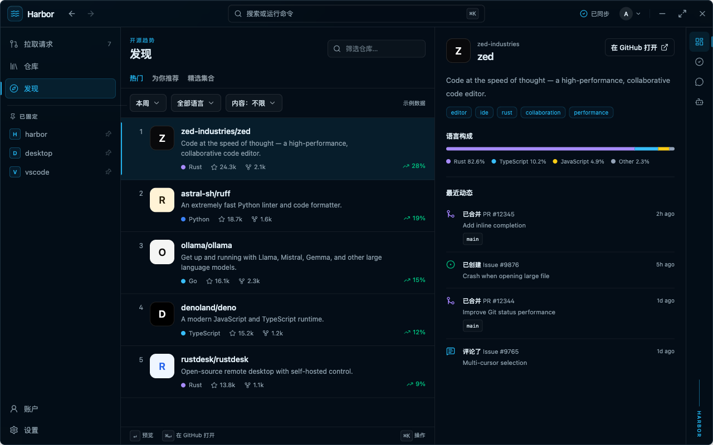

<div align="center">

# Harbor

**把 GitHub 上的事，放进一个清爽的桌面工作台。**

写给每天泡在 GitHub、又不想被浏览器标签页淹没的人。

[English](README.md) · [现有功能](#现有功能) · [本地运行](#本地运行) · [参与贡献](#参与贡献)

[](https://v2.tauri.app/)
[](https://www.rust-lang.org/)
[](https://react.dev/)
[](https://www.typescriptlang.org/)
[](https://github.com/Excelius-Wang/harbor/blob/main/LICENSE)
[](https://github.com/Excelius-Wang/harbor)

</div>



> [!IMPORTANT]
> Harbor 仍在积极开发，暂时没有可直接下载的公开安装包。现在可以从源码运行，也欢迎一起打磨产品。

## 为什么做 Harbor？

GitHub 的功能很全，但日常工作散落在通知、仓库标签页、评审页面、Actions 运行记录和搜索结果里。
Harbor 把个人开发者常用的 GitHub 工作流收进桌面应用，GitHub 仍是所有数据的最终来源。

目标很直接：少花时间找页面，多花时间弄清楚接下来该处理什么。

## 现有功能

- **个人收件箱**：集中查看账号下的通知、Issue、拉取请求、Project 和 Gist。
- **完整的仓库工作区**：覆盖代码、Release、Issue、拉取请求、Discussion、Actions、安全告警和仓库设置。
- **够用的代码评审工具**：支持源码高亮、blame、历史记录、代码 diff、暂存评审、评审线程、检查状态、合并操作和原生文件下载。
- **少跳转的 Actions 体验**：可以触发和筛选工作流，查看 Job、Step、日志和产物，也能重跑、取消或管理工作流。
- **仓库发现**：发现好项目，并在同一处查看仓库近期动态。
- **桌面应用该有的细节**：命令面板、全局快捷键、系统托盘、自动更新机制、明暗主题，以及中英文界面。
- **可选的仓库问答侧栏**：接入 DeepWiki，可回答公开仓库问题；目前不会读取私有仓库。

## Harbor 的取舍

- **核心流程尽量原生。** 常用操作直接走 GitHub API；平台没有提供安全接口时，再回到 GitHub Web。
- **切换页面时保留上下文。** 从列表进入 Issue、评审、工作流或文件后，返回时不用重新找位置。
- **GitHub 始终是数据源。** Harbor 不另造一份仓库状态。
- **模块之间只留小接口。** GitHub 客户端、凭据存储、本地缓存和 Agent Provider 各自放在小接口后面，方便替换和测试。

## 本地运行

### 环境要求

- [Node.js](https://nodejs.org/) 和 [pnpm](https://pnpm.io/)
- 稳定版 [Rust 工具链](https://www.rust-lang.org/tools/install)
- 当前平台对应的 [Tauri 2 系统依赖](https://v2.tauri.app/start/prerequisites/)
- 一个经典 [GitHub OAuth App](https://docs.github.com/zh/apps/oauth-apps/building-oauth-apps/creating-an-oauth-app)，用于登录并访问 GitHub 工作流

克隆仓库并安装依赖：

```bash
git clone https://github.com/Excelius-Wang/harbor.git
cd harbor
pnpm install
```

创建经典 GitHub OAuth App，并填写下面的回调地址：

```text
http://127.0.0.1:49152/oauth/github/callback
```

在仓库根目录新建 `.env.local`，写入 OAuth App 凭据：

```dotenv
HARBOR_GITHUB_CLIENT_ID=your_oauth_client_id
HARBOR_GITHUB_CLIENT_SECRET=your_oauth_client_secret
```

`.env.local` 已被 Git 忽略，请不要提交。然后启动桌面应用：

```bash
pnpm tauri:dev
```

## 开发

提交改动前，先跑一遍前端完整检查：

```bash
pnpm check
```

改动 `src-tauri` 下的 Rust 代码时，再单独检查后端：

```bash
cargo check --manifest-path src-tauri/Cargo.toml
```

桌面外壳由 Tauri 2 和 Rust 驱动。界面使用 React 19、TypeScript、Vite、Tailwind CSS 和
shadcn/ui；TanStack Query 负责同步服务端状态，i18next 提供简体中文和英文界面。

## 参与贡献

Harbor 还在成形，现在提出具体反馈最有价值。发现问题，或者有一个能明显改善使用体验的工作流，
可以直接[提交 Issue](https://github.com/Excelius-Wang/harbor/issues)。如果改动比较大，建议先开 Issue，
把产品行为和 GitHub API 边界聊清楚再动手。

如果你也想要这样一款 GitHub 桌面工作台，欢迎
[给仓库点个 Star](https://github.com/Excelius-Wang/harbor)。这会让更多开发者看到 Harbor。

## 项目基础、许可证与署名

项目最初的应用外壳基于
[kitlib/tauri-app-template](https://github.com/kitlib/tauri-app-template)。Harbor 维护自己的产品架构，
只通过边界清晰的小接口引入外部实现。

Harbor 的自有代码采用
[AGPL-3.0-only](https://github.com/Excelius-Wang/harbor/blob/main/LICENSE)。复制或修改 Harbor 时，必须保留
[NOTICE](https://github.com/Excelius-Wang/harbor/blob/main/NOTICE) 中的作者署名和原始仓库链接。模板的 MIT 声明及其他第三方声明见
[THIRD_PARTY_NOTICES.md](https://github.com/Excelius-Wang/harbor/blob/main/THIRD_PARTY_NOTICES.md)。
