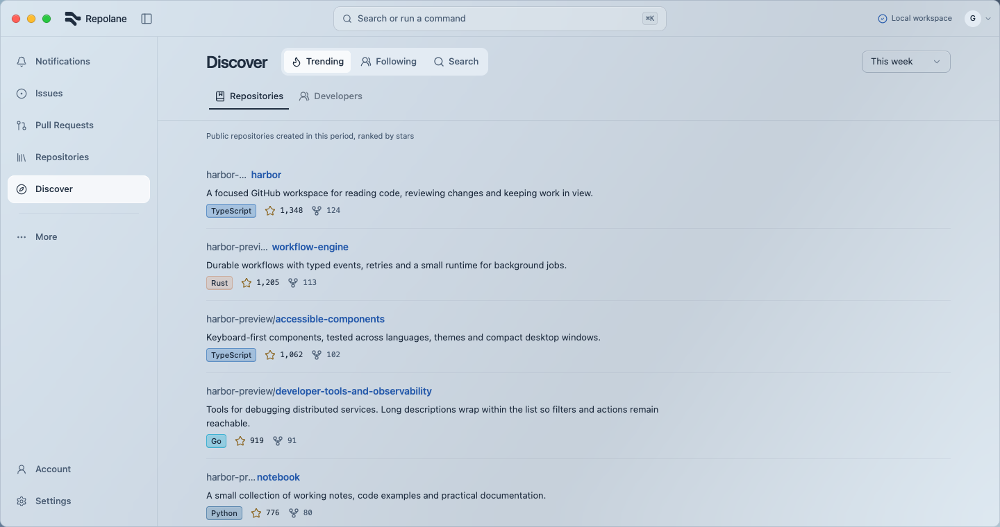

<div align="center">


# Repolane

**把 GitHub 上的日常工作，放进一个专注的桌面工作台。**

在同一个窗口里阅读代码、评审 PR、跟进动态和处理仓库事务。

[English](README.md) · [现有功能](#现有功能) · [本地运行](#本地运行) · [开发](#开发) · [参与贡献](#参与贡献)

[](https://v2.tauri.app/)
[](https://www.rust-lang.org/)
[](https://react.dev/)
[](https://www.typescriptlang.org/)
[](LICENSE)
[](https://github.com/Excelius-Wang/harbor)

</div>

<picture>
  <source media="(prefers-color-scheme: dark)" srcset="screenshots/repolane-workspace-dark.png" />
  <source media="(prefers-color-scheme: light)" srcset="screenshots/repolane-workspace-light.png" />
  
</picture>

_截图来自生产组件的浏览器预览，使用本地演示数据。[查看深浅主题及验证说明](docs/verification/repolane-lane/README.md)。_

> [!NOTE]
> Harbor 的产品名称已改为 Repolane，仓库仍为 `Excelius-Wang/harbor`，原有 `HARBOR_*` 配置名称保持不变。
> 项目仍在开发中，暂时没有公开安装包。目前的打包流程面向 macOS，其他平台尚未验证。

## 为什么做 Repolane？

处理一条通知，往往要接着打开 Issue、拉取请求和工作流记录，浏览器标签页也越开越多。
Repolane 把这些相关工作收进桌面应用，GitHub 仍是数据来源。

界面保留紧凑的导航、深浅主题和各自独立滚动的内容区。需要更多阅读空间时，可以收起侧栏，
应用会记住你的选择。阅读公开仓库遇到疑问，也可以打开问答侧栏。

## 现有功能

| 工作区     | 可以做什么                                                                                                             |
| ---------- | ---------------------------------------------------------------------------------------------------------------------- |
| 个人工作   | 集中查看账号下的通知、Issue、拉取请求、Project 和 Gist。                                                               |
| 代码与评审 | 浏览仓库文件、源码高亮、blame、历史记录和 diff，处理暂存评审、评审线程、检查状态及合并。                               |
| 仓库管理   | 查看和处理 Release、Discussion、Actions 运行记录、安全告警及仓库设置，需要时跳转 GitHub Web。                          |
| Actions    | 触发和筛选工作流，查看 Job、Step、日志及产物，重跑、取消或管理工作流。                                                 |
| Packages   | 查看包和版本详情，在权限及包状态允许时删除或恢复版本。                                                                 |
| 发现       | 搜索仓库、发现开发者、查看关注动态。仓库发现列表按星标数排列指定时间内新建的公开仓库，不是 GitHub 官方 Trending 排名。 |
| 仓库问答   | 可选的 DeepWiki 问答侧栏，用于公开仓库；不会向该服务发送私有仓库名称或相关提问。                                       |
| 桌面操作   | 命令面板、全局快捷键、系统托盘、可折叠导航，以及中英文和深浅主题切换。                                                 |

实际可用的操作取决于 GitHub 权限和仓库状态，部分流程会打开 GitHub Web。
已有功能仍有一些原生交互需要验收，进度见 [UI 迁移清单](docs/UI_MIGRATION_CHECKLIST.md)。

## 本地运行

### 环境要求

- [Node.js](https://nodejs.org/) 和 [pnpm](https://pnpm.io/)
- 稳定版 [Rust 工具链](https://www.rust-lang.org/tools/install)
- 当前平台对应的 [Tauri 2 系统依赖](https://v2.tauri.app/start/prerequisites/)
- 一个经典 [GitHub OAuth App](https://docs.github.com/zh/apps/oauth-apps/building-oauth-apps/creating-an-oauth-app)，用于登录并访问 GitHub

```bash
git clone https://github.com/Excelius-Wang/harbor.git
cd harbor
pnpm install
```

将 OAuth App 的回调地址设置为：

```text
http://127.0.0.1:49152/oauth/github/callback
```

在仓库根目录创建 `.env.local`：

```dotenv
HARBOR_GITHUB_CLIENT_ID=your_oauth_client_id
HARBOR_GITHUB_CLIENT_SECRET=your_oauth_client_secret
```

保留上述 `HARBOR_*` 变量名。`.env.local` 已被 Git 忽略，请勿提交其中的凭据。然后启动桌面应用：

```bash
pnpm tauri:dev
```

### 不登录，先看界面

安装依赖后，启动开发预览：

```bash
pnpm dev:ui --port 1423
```

打开 [localhost:1423](http://localhost:1423/) 查看工作区，或打开
[localhost:1423/ui-components](http://localhost:1423/ui-components) 查看组件库。
预览使用本地演示数据，不需要 OAuth 凭据，也不会向 GitHub 发送业务操作；它不能验证原生窗口行为。
更多场景见 [开发预览说明](docs/UI_COMPONENTS.md)。

## 开发

```bash
pnpm check
cargo check --manifest-path src-tauri/Cargo.toml
```

`pnpm check` 包含格式检查、lint、测试、TypeScript 检查和前端生产构建。
改动 Rust 后端时，再运行第二条命令。

应用使用 Tauri 2、Rust、React 19、TypeScript、Vite、Tailwind CSS 和 shadcn/ui。
TanStack Query 负责服务端状态，i18next 提供中英文界面。

- [工作区约定](AGENTS.md)：分支流程和实现规范。
- [UI 设计指南](docs/UI_DESIGN_GUIDE.md)：紧凑布局、共享控件和界面材质。
- [组件预览说明](docs/UI_COMPONENTS.md)：生产组件及可控的测试场景。

## 参与贡献

发现问题，或有想改善的工作流，欢迎[提交 Issue](https://github.com/Excelius-Wang/harbor/issues)。
较大的改动建议先讨论产品行为和 GitHub API 边界。请使用独立分支，控制改动范围，并附上相关验证结果。

如果 Repolane 对你有帮助，欢迎[给仓库点个 Star](https://github.com/Excelius-Wang/harbor)，让更多开发者看到它。

## 项目基础与许可证

项目最初的应用外壳基于 [kitlib/tauri-app-template](https://github.com/kitlib/tauri-app-template)。
GitHub 客户端、凭据存储、本地缓存和 Agent 运行时各自保留小接口，便于替换和测试。

项目的自有代码采用 [AGPL-3.0-only](LICENSE)。复制或修改时，请保留 [NOTICE](NOTICE)
中的作者署名和原始仓库链接。模板的 MIT 声明及其他保留的第三方声明见
[THIRD_PARTY_NOTICES.md](THIRD_PARTY_NOTICES.md)。
