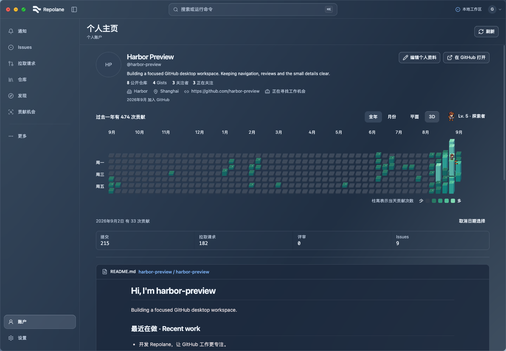
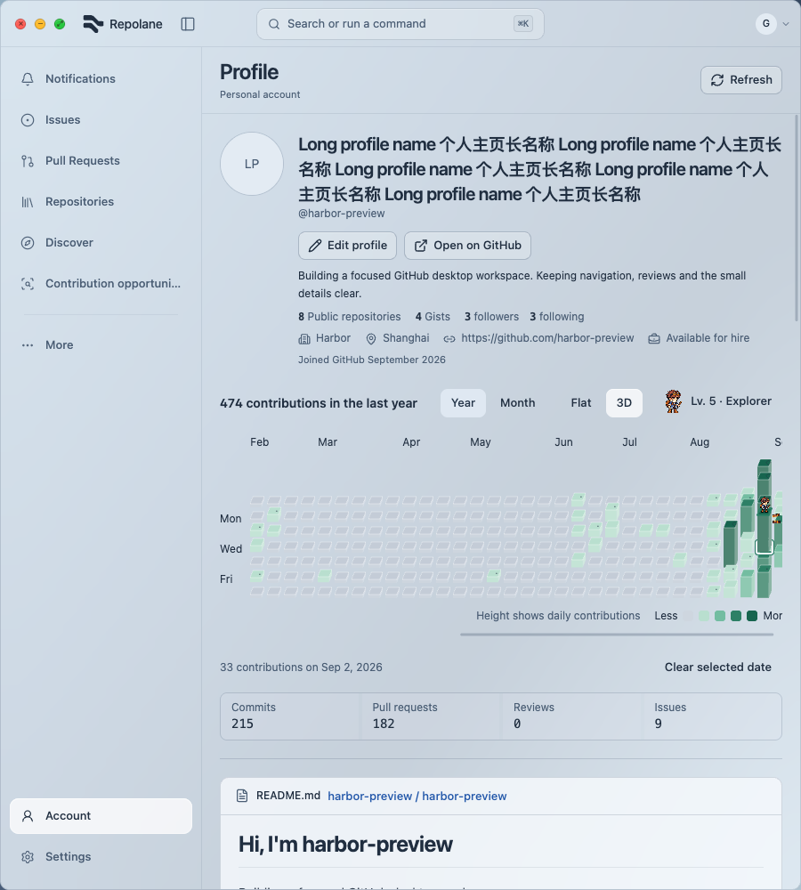
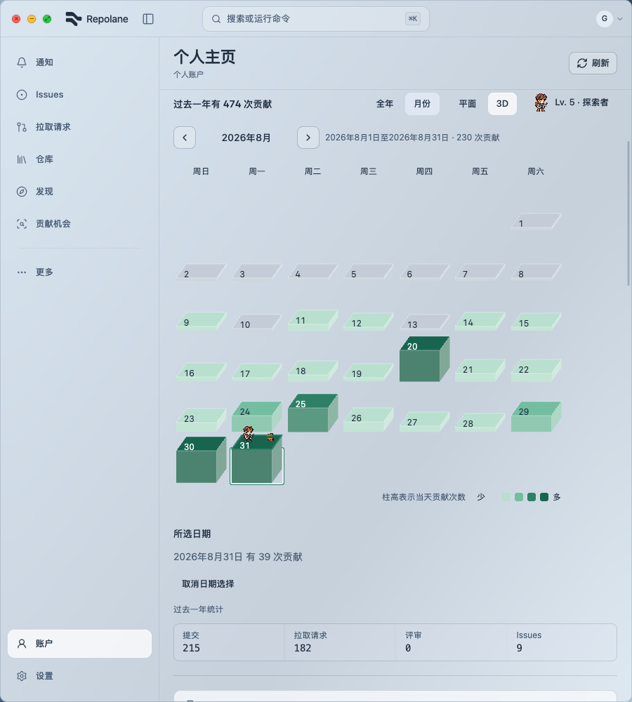
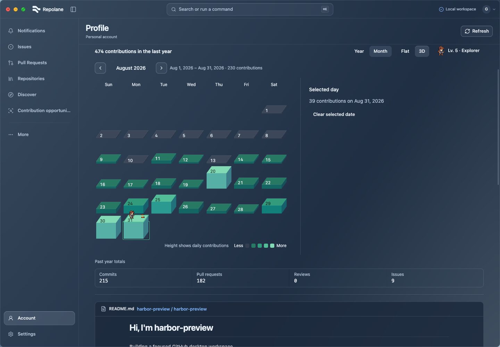
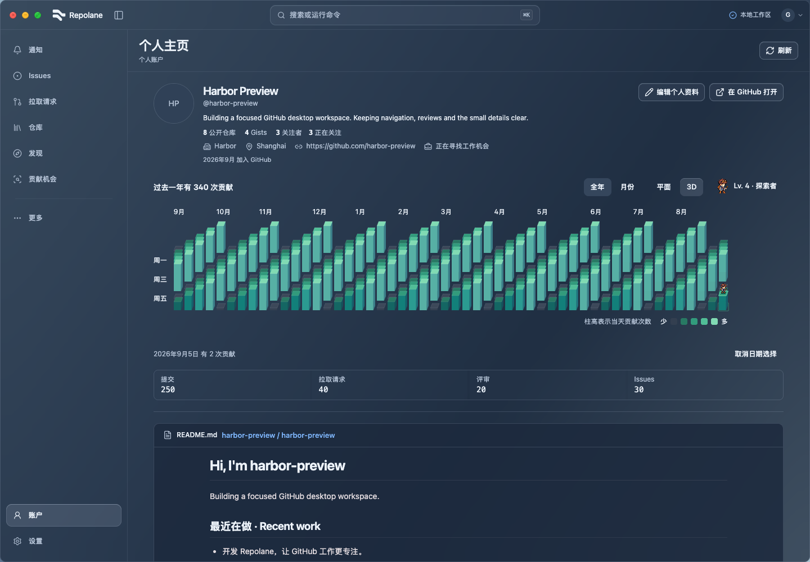
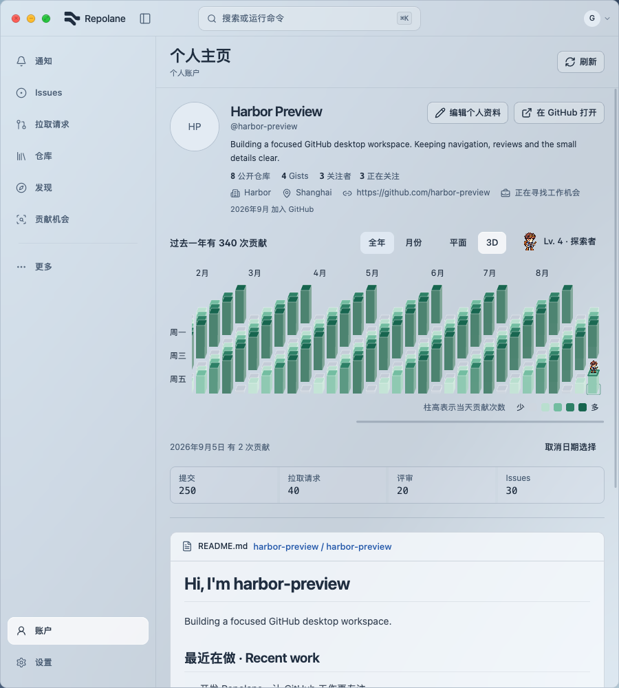
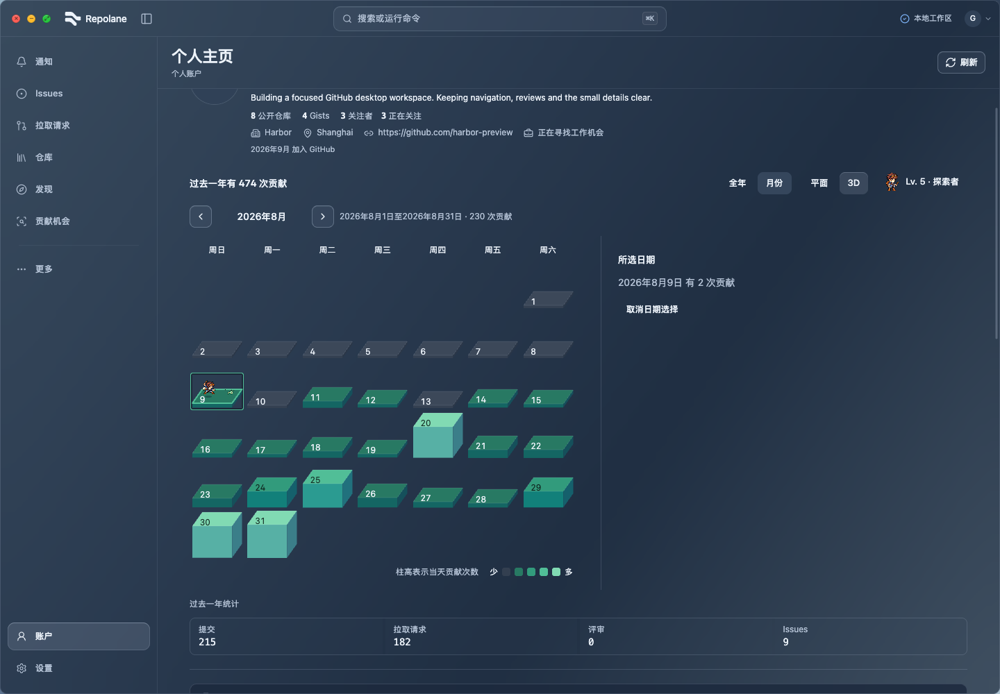

# Inline 3D contribution calendar

Implemented on 2026-09-25 on `feat/contribution-calendar-3d`, following the approved annual concept with the resident pixel companion interaction. The first functional draft was reviewed as visually incomplete; the same branch now includes the requested visual refinement.

## Behavior

- The default annual calendar uses a fixed oblique 3D appearance. Flat/3D is independent of Year/Month and retains selected dates and keyboard navigation when switched.
- Data-driven column height is linear in each day's contribution count, normalized against the annual maximum and capped at 44 px above a shared 4 px base. Zero contributions retain the base only; month view keeps the same scale. SVG top/front/side polygons meet at shared vertices instead of independently skewed rectangles. Semantic contribution colors are retained; the zero-day face uses a slightly stronger neutral mix for legibility.
- The 3D companion stands on the selected column top: 18 px in year view and 24 px in month view, with a small contact shadow. Feet anchor to the measured top face (center normally, 32% across a monthly encounter cap to leave room for its object at 77%), including after refresh and resize. Selection adds no reserved lane or layout gap; monthly horizontal gaps are 8 px. Existing flat sprites remain 32/48 px. 3D encounters are restored using existing art: annual event marks show chest/bug distribution and hover tooltips explain them; a selected monthly cap displays the full object. Arrival, encounter and feedback each last 180 ms, followed by standing. A session-only explored-date count records completed visits once per date, including zero-contribution dates; it does not add experience. Reduced motion shows static results. Flat behavior is preserved. Nearby dates (one or seven days apart, at most 80 px from the actual current position) use a 180 ms hop; distant dates fade out/in. Rapid selection cancels and replaces movement. Hidden/paused views suspend movement, reduced motion places directly, and refresh/reflow repositions without replay.
- Selected-date details stay below the year grid; month details sit beside the board when the calendar container is at least 820 px wide, and below it otherwise. An explicit clear action remains available. Tooltips show only on hover or keyboard focus; selection itself no longer leaves a tooltip over the graph. Tooltip offset follows column height so it does not intercept clicks on tall tops. Escape and the existing outside-pointer dismissal remain available. Keyboard-triggered refresh preserves selection; clicking outside the calendar still dismisses it.
- Year mode keeps its own horizontal scroll; appearance changes reveal the selected date without resizing the window. A bounded loading placeholder and a no-date message cover unavailable data.
- No new dependency, Rust/native change, API call, business write, global material or navigation change. The optional expanded orbit/zoom concept is outside this batch.

## Verification

- `pnpm check` passes: 751 tests in 145 files, formatting, lint, TypeScript and production build. Log: `/tmp/harbor-review115-check.log`. Existing harbor-rail ref-cleanup lint warning, Node SQLite experimental warning and bundle-size warnings remain.
- Calendar regressions cover appearance/refresh selection and counts and stable annual height scaling. Three resident tests cover cap-center placement and refreshed heights, hop/fade selection, interrupted travel, pause/completion and reduced motion. The tooltip regression now verifies that selection stays visible in the detail area without a persistent tooltip. Existing calendar/companion regressions remain passing.
- [Encounter interaction results](encounter-results.json): eight EN/ZH × light/dark × 900/1440 cases at height 1000. Both year and month were captured after refinement. Checks cover clicks on actual visible column tops, feet aligned to the selected cap within 1 px, continuous week spacing, restored encounter objects, tooltip dismissal, responsive month details, bounded heights, page overflow, keyboard navigation, keyboard refresh, menu pause and Escape, and reduced motion. No page errors were observed. Narrow cases include long profile text.
- [State results](state-results.json): rerun on 2026-09-26 after the CodeRabbit follow-up. The zero-contribution fixture must contain date buttons before checking that every extrusion is zero. The 32 combinations cover loading, retryable error, zero-contribution data and stale retained results across both languages/themes/widths at height 760. Stale selection and display switching remain usable.
- [Encounter action results](encounter-action-results.json): bug encounter pauses in the background, repeated visits count once, zero-contribution days remain explorable, and hover preserves selection. Two added unit tests cover interrupted encounters, duplicate visits and static reduced-motion completion.
- [Motion results](motion-results.json), rerun on 2026-09-26: nearby hop, distant fade, rapid replacement, background pause with a required running animation before hiding and a required paused animation before comparing time, resize and reduced motion pass. Feet and contact-shadow centers remain within 1 px of the selected cap.
- [Prior dense results](dense-results.json), reused for unchanged geometry/keyboard handling: two synthetic dense-calendar cases (dark 1440 / light 900) check top-face selection, nonsticky tooltips, page overflow and Home/Enter access to earlier dates.
- Selected captures were visually inspected in both themes and widths. These are browser layout/interaction checks using intercepted preview calls and the existing recorded contribution snapshot; identity metadata is synthetic. They do not establish fresh live GitHub data, native desktop translucency or full-site acceptance. Prior evidence applies only to unchanged surrounding shell/overlay behavior.

## Reproduce

Run `pnpm dev:ui --port 1439`. Open `/ui-components?view=opportunities&calendar=real&links=record` in Playwright CLI, then run [encounters.js](encounters.js), [encounter-actions.js](encounter-actions.js), [motion.js](motion.js) and [states.js](states.js). The prior [qa.js](qa.js) and [dense.js](dense.js) retain historical evidence and assumptions; do not use the old no-encounter assertion for the current UI. Run current scripts sequentially with `run-code --filename`. Create `output/playwright/calendar-3d/` first. All business calls remain intercepted.

The scripts are arrow-function expressions consumed by Playwright CLI; omit the trailing expression semicolon. Do not edit source or format files during the matrix: Vite reloads can reset navigation. When checking background pause, wait for pending animation pause requests to settle before comparing currentTime. Radio-group keyboard checks hold ArrowRight for 80 ms so Radix's deferred focus occurs before keyup. An initial mouse-triggered refresh check dismissed the date through the existing outside-pointer behavior; the final refresh check uses keyboard activation, matching the prior calendar regression.

The column bases can be visually occluded by taller foreground days, as expected in this projection. Click visible top faces; keyboard navigation and Flat view retain access to every date. The prior center-of-button click targeted an occluded base rather than the visible face. A separate real defect was found and fixed: the floor-anchored tooltip could cover a tall top and intercept its click.

Raw screenshots remain in `output/playwright/calendar-3d/`; returned results and representative captures are retained here.

## Same-content comparison

Both images below use the same 1440 × 1000 viewport, recorded contribution data and selected date (2026-09-02). The rooftop revision removes the reserved lane and places a smaller companion on the selected cap, with no persistent tooltip. This comparison is a design review artifact, not a claim of user visual acceptance.

[Before rooftop revision](before-rooftop-zh-dark-1440-year.png) · [After](zh-dark-1440-year.png)

## Captures

## CodeRabbit follow-up — 2026-09-26

Both test-only findings were addressed. The 32 state cases and movement checks pass; movement evidence records one paused animation. An initial state run was interrupted by a preview reload after editing the harness; the unchanged rerun passed. Application code and the prior visual captures are unchanged.
