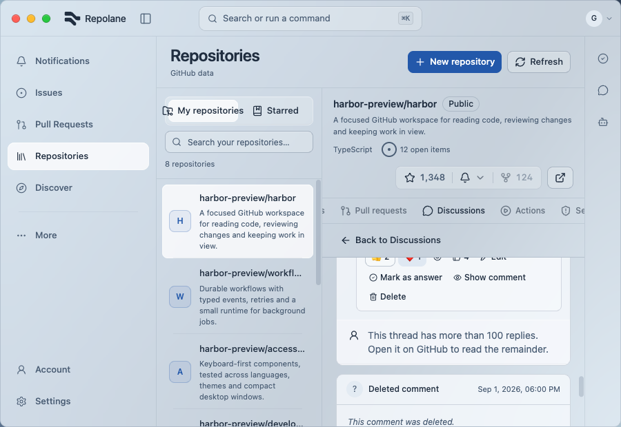
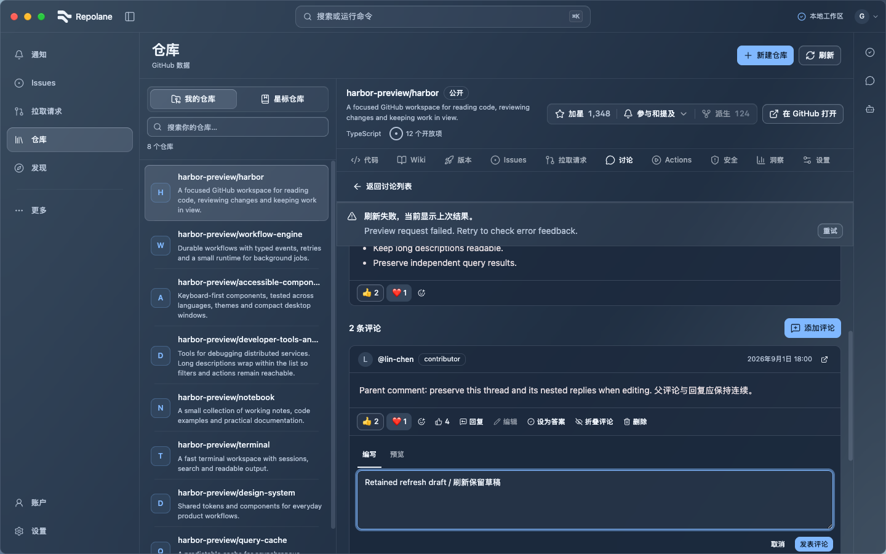
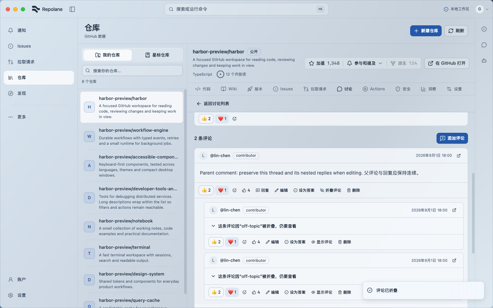
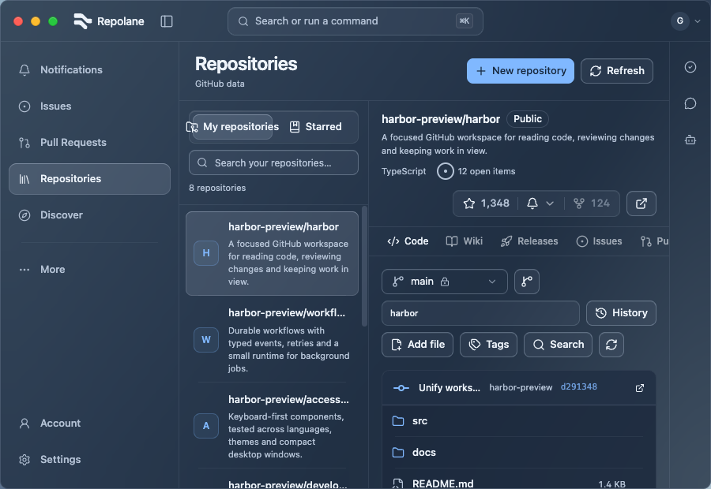

# Discussion reply acceptance — 2026-09-09

Production UI with controlled preview data; no real GitHub business writes. These captures show the final viewport-width and repository-header layout. Full matrix scope and limitations are in [UI verification](../../UI_VERIFICATION.md).

