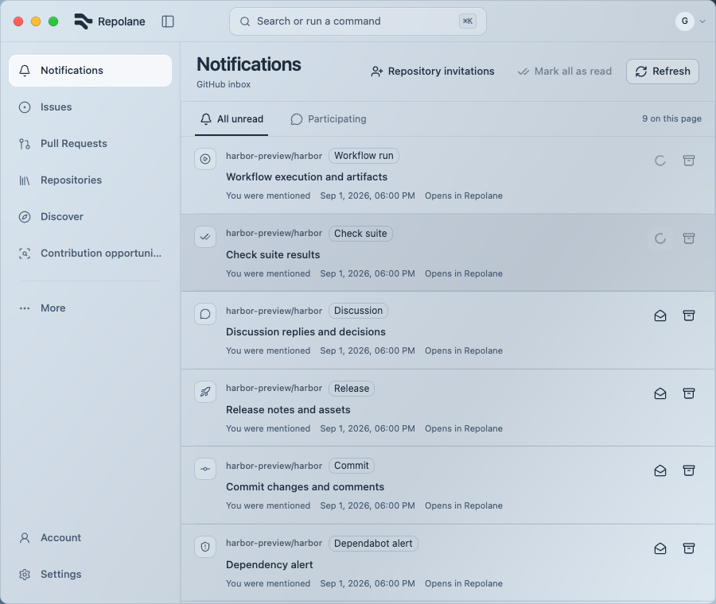
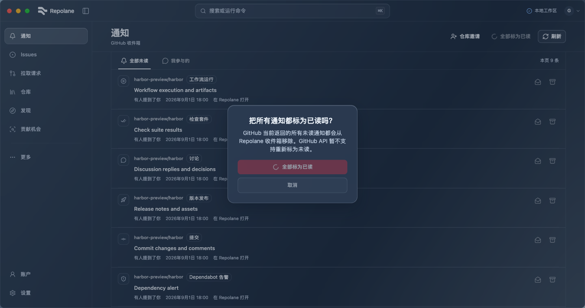

# Notification in-flight fixes (#107, #108)

Implemented locally on `fix/notification-inflight`, based on `8cb6765`, in the separate worktree `/Users/bytedance/Documents/Work/Code/harbor-worktrees/notification-inflight`.

Notification updates share a TanStack Query mutation key. The page derives all pending targets with useMutationState and checks QueryClient synchronously before submitting. Different threads can still run concurrently; the same thread cannot submit another read/done, including automatic mark-read from opening its title. Bulk marking waits for thread writes, and thread writes wait for bulk marking. Pending confirmation dialogs reject Escape; success closes them and failure permits retry/cancel. Shared AlertDialog and other UI primitives are unchanged.

Verification on 2026-09-14:

- Four new interaction regressions failed before the fix, then passed. Covers A→B→A with out-of-order completion and failure/retry, automatic mark-read duplication, pending bulk Escape/failure/retry and pending single done Escape/success. Two additional done-failure retry/cancel cases and the existing three mutation/cache tests also pass (`/tmp/harbor-notification-focused.log`).
- `pnpm check`: 723 tests / 143 files, formatting, lint, TypeScript and build pass (`/tmp/harbor-notification-check.log`). No Rust/native code changed.
- [Browser results](results.json): 32 checks across EN/ZH, light/dark and 900/1440 px at 760 px height. Covers parallel pending rows with exactly two intercepted write calls, bulk exclusion, both Escape guards, keyboard mark-read, successful bulk clearing and no horizontal overflow/page errors.
- Initial browser assertions read disabled state before Query observer rendering. Settled snapshots confirmed the pending controls, and the final script waits for their DOM state. Final full rerun passed.
- Reproduce: `pnpm dev:ui --port 1438`; open `/ui-components?view=opportunities&notifications=targets&writes=accept&links=record`, then select Notifications. Run [qa.js](qa.js) using Playwright CLI run-code, with `output/playwright/notification-inflight/` created. The script uses existing state/commands fixtures for pending writes; all business calls remain intercepted.

These checks verify the affected action states. Loading/empty/detail/list layout, typography and material are unchanged; prior evidence applies only to those paths. No real GitHub notifications were changed and no full-site/native-material acceptance is claimed. Existing syntax-highlighting hook, experimental SQLite and chunk-size warnings remain unrelated.

## PR review

Standards review: zero findings. Spec review identified one missing acceptance case: failed single-done recovery. Two parameterized component cases now verify error feedback, retained confirmation, enabled controls, retry success and cancel without another request. The follow-up spec review confirmed that the gap is closed. No runtime implementation change was needed.

Final pre-rebase validation: nine focused tests and `pnpm check` (723 tests/143 files) passed; `/tmp/harbor-pr111-review-check.log`. Existing 32 browser cases remain applicable because this follow-up changes tests only.
