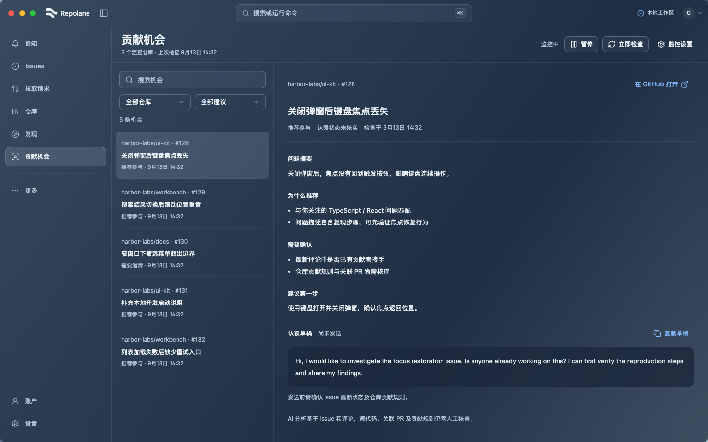
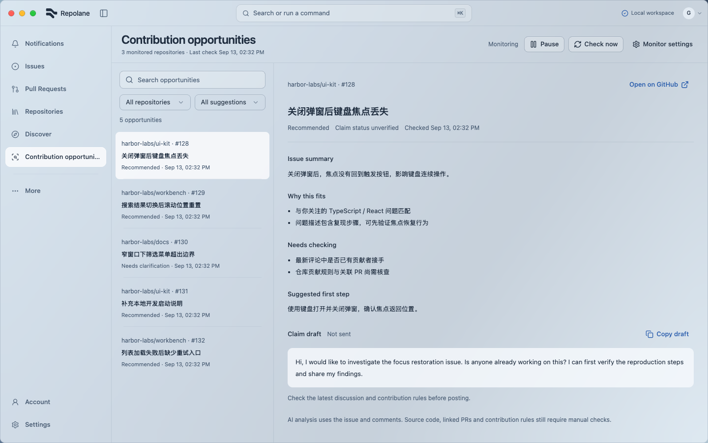
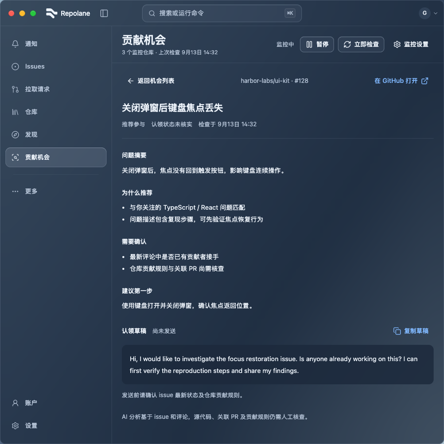
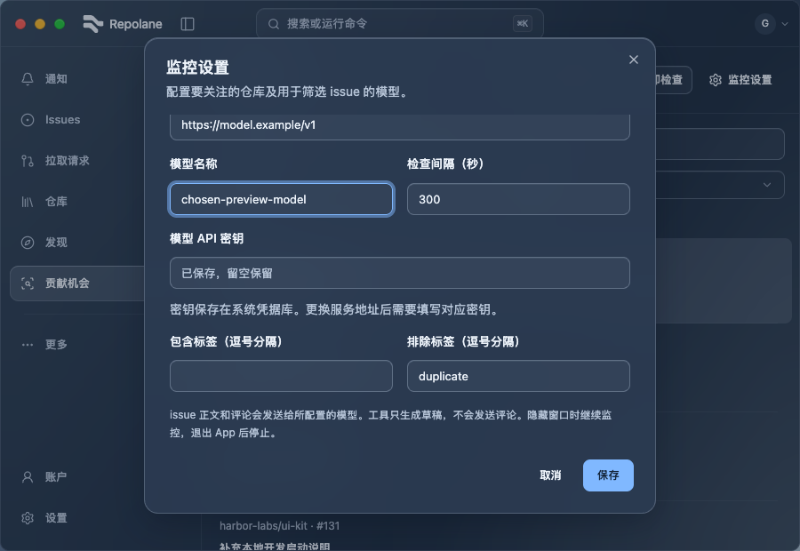
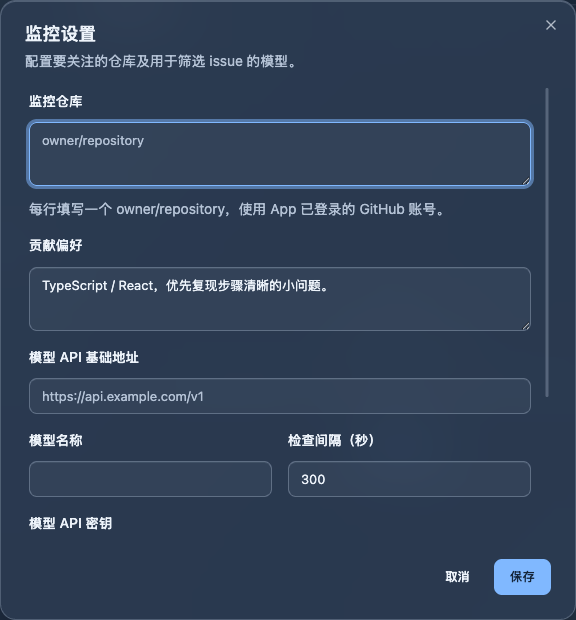

# Contribution opportunities App integration

Implemented on 2026-09-13 on `feat/opportunity-app`, using the user's approved second mockup as layout direction. This is a bounded feature delivery, not full-site acceptance or a live model-quality claim.

## Delivered behavior

- The shared primary navigation and command palette include Contribution opportunities. The existing title bar, Lane mark, semantic material tokens and navigation states are reused.
- A compact header owns monitoring controls. The result list supports repository/decision/search filters; details show analysis, uncertainty, the first investigation step, an external GitHub action and a copyable claim draft.
- At the existing 80rem breakpoint, list and detail sit side by side. Narrow detail return retains filters, scroll and focus. Long titles wrap in the reading pane.
- The settings Dialog keeps its draft on failure and never preloads an API key. Its viewport has a bounded height and absolute containment; short-window regression checks prove that scrolled fields do not cover Save or collapse to zero height.
- Rust owns the polling task, cancellation, incremental cursors, rule filters, model requests and SQLite state. Settings and progress persist; system keyring stores model keys by endpoint. No Node runtime is required by the App.
- GitHub reads use the existing OAuth credential loader. Logout pauses/cancels the monitor without preventing logout if monitor persistence fails. The existing close-window action hides the window, so monitoring continues; quitting the App stops it. Previously enabled monitoring resumes on startup.
- Drafts are not sent. Linked PRs, repository contribution rules and source code still require manual checks. App and CLI databases are independent.

## Verification

- `pnpm check`: 713 tests in 142 files plus format, lint, TypeScript and production build pass. Six new UI tests cover filtering/detail return, native control contracts, stale retained results, failed settings save, stale-copy guards and isolated preview writes. The 18 CLI tests remain passing.
- `cargo test --locked --offline --manifest-path src-tauri/Cargo.toml opportunity:: --lib`: 12 tests pass, including SQLite reopen, cancellation across restart, configuration guards, duplicate and same-second assignment handling, credential-free snapshots, local HTTP request/response, rate deadline and network cancellation.
- `cargo check --locked --offline --manifest-path src-tauri/Cargo.toml`: passes. The first online registry request failed with a connection reset; cached offline resolution succeeded. Disabling unused rusqlite defaults kept existing lockfile resolutions unchanged.
- Browser baseline: English/Chinese × light/dark × 900/1440 widths, all at height 900, including detail and settings captures. Additional 900 × 620 dense-list detail return retained a scroll position above 500 px.
- [State results](states-results.json): 48 combinations of setup, empty, pending, stale, long/dense and rate-failure states across both languages/themes/widths at height 620, plus persisted settings, keyboard filtering and an intercepted GitHub link. Loading was separately checked at 900 × 620. After separating first-load errors from retained-result notices, eight additional theme/language/width cases verified the initial error and Retry action.
- [Settings results](settings-results.json): eight short-window combinations assert a noncollapsed scroll viewport, scroll through the form, save, reopen and verify the saved model value. A real footer-overlap bug was found and corrected before these results.
- Console inspection found development info messages only during the controlled visual passes. Existing unrelated hook and bundle-size warnings remain non-blocking; the CLI tests retain Node's SQLite experimental warning.

## Selected browser captures

All captures use synthetic data; the interface language and stored analysis language can differ. These captures establish layout and in-page materials, not native desktop-background translucency. Global material tokens and native window effects are unchanged. Native keychain access and real model/GitHub end-to-end usage have not been exercised in this delivery because no target repositories or model credentials were configured.

## Reproduce

Run `pnpm dev:ui --port 1437`, then open `/ui-components?view=opportunities&writes=accept&links=record` with Playwright CLI. Execute [settings-qa.js](settings-qa.js) and [states-qa.js](states-qa.js) sequentially with `run-code --filename`; create `output/playwright/opportunity-app/` first. Do not run concurrent scripts against the same browser session.

Fixture variants use `opportunities=setup|empty|pending|stale|long|dense|failure`. Scope `state=loading|error|stale&commands=opportunity_snapshot` to read failures. All opportunity business calls are intercepted; writes require `writes=accept` and unknown commands fail locally.

Raw captures and logs remain in `output/playwright/opportunity-app/` and `/tmp/harbor-opportunity-*.log`. A real provider and a bounded repository sample remain the next product validation step.

## Settings scrollbar refinement — 2026-09-13

The user reported the settings scrollbar touching the fields and requested a slimmer appearance. The form now reserves 20 px of right padding; measured clearance from the field border to the scrollbar track is 10 px. The visible thumb is 3 px wide, while its original 7 px draggable element and 10 px track remain intact. The styling is scoped to this Dialog and uses the existing muted text token with restrained opacity and hover feedback.

[Scrollbar QA](scrollbar-qa.js) exercised EN/ZH, light/dark and 900/1440 px widths at height 620. All eight cases verified clearance, thumb geometry, actual mouse dragging, scrolling to the final fields and saving. `pnpm check` passes 713 tests/142 files and the production build (`/tmp/harbor-opportunity-scrollbar-check.log`); existing warnings remain. Prior native and other view evidence applies only to unchanged behavior.

## Shared scrollbar rollout — 2026-09-13

The user approved applying the settings treatment throughout the App. Shared Radix vertical and horizontal thumbs now draw a centered 3 px line inside their existing pointer targets. Native WebKit scrollbars use a 9 px track with a 3 px transparent border around a 3 px thumb; tracks are transparent and hover/active thumbs gain contrast. The filter menu no longer overrides the shared native style. Intentionally hidden scrollbars remain hidden, and the settings form retains its 10 px field-to-track gap.

[Reproducible browser script](shared-scrollbar-qa.js) mounts the production ScrollArea/ScrollBar in an isolated browser-only fixture after checking the actual component gallery. [Eight results](shared-scrollbar-results.json) cover EN/ZH, light/dark and 900/1440 px: vertical/horizontal pointer dragging, native textarea wheel scrolling and computed native thumb geometry pass. The settings dialog's eight drag/save cases also pass after rollout. Dark and light captures were visually inspected; native scrollbar visibility remains subject to OS auto-hiding. This is representative shared-control coverage, not full-site or native WebView acceptance.

`pnpm check` passes: 713 tests / 142 files, formatting, lint, TypeScript and build. Log: `/tmp/harbor-shared-scrollbar-check.log`. Existing hook and bundle-size warnings remain. No native code changed in this follow-up.
