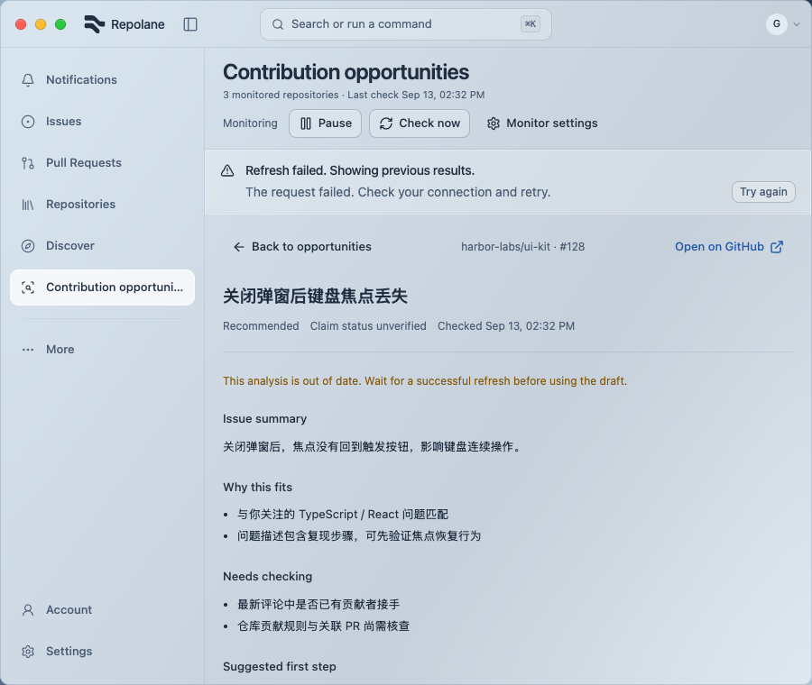
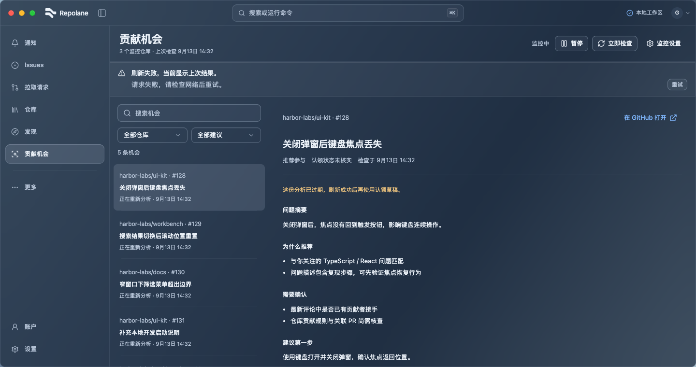

# Opportunity refresh fixes (#99, #101)

Implemented locally on `fix/opportunity-refresh-state`, based on `8cb6765`.

Open issues that still satisfy the rules retain their previous brief and successful check time while reanalysis is pending or fails. Closed, locked, assigned and excluded issues still lose their recommendation. A separate optional persisted last-attempt time keeps retry ordering fair and loads older state without a migration. Interval-only settings changes preserve analysis/pending state and reschedule the next check; other configuration changes retain re-screening behavior.

Verification on 2026-09-14:

- Red phase: three native regressions failed on the original behavior; final 27 opportunity native tests and cargo check pass (`/tmp/harbor-opportunity-refresh-native.log`). Covers retained updates/failure/success, invalidation by rules, interval-only scheduling, analysis-setting changes, retry ordering, SQLite reopen and legacy state.
- `pnpm check` passes 718 tests / 142 files, formatting, lint, TypeScript and production build (`/tmp/harbor-opportunity-refresh-check.log`). One new component regression covers selected-brief retention and disabled draft through a failed refresh and successful retry.
- [Browser results](results.json): eight EN/ZH × light/dark × 900/1440 cases pass at 760 px height. Controlled stale failure remains readable, keyboard retry succeeds, draft copying becomes available, selection remains and narrow detail return works. No page errors or document horizontal overflow.
- Reproduce with `pnpm dev:ui --port 1437`, open `/ui-components?view=opportunities&opportunities=refresh-failed&writes=accept&links=record`, and run [qa.js](qa.js) using Playwright CLI run-code. Create `output/playwright/opportunity-refresh/` first. All business operations are intercepted fixtures.




The existing UI primitives/layout and native material did not change. Prior loading/empty/settings/layout evidence applies only to those unchanged paths; this is not full-site or native translucency acceptance. Real keyring/model/GitHub evaluation was not performed. Existing syntax-highlighting hook, SQLite experimental and bundle-size warnings remain unrelated.


## PR review

Standards and Spec review found no initial blockers. CodeRabbit found one valid retry-fairness edge: a changed issue could lose its last-attempt timestamp during observation and reenter the untried queue. Observation now preserves that timestamp for tracked relevant work, with or without a retained brief. A new regression failed before the fix and passes afterward; 27 native tests, cargo check and pnpm check (718 tests) pass. Logs: `/tmp/harbor-pr110-native-final.log` and `/tmp/harbor-pr110-check-final.log`. The bounded follow-up Spec review found no remaining issue. Existing browser evidence applies because this correction changes only backend retry ordering.

After inspecting fresh captures, update the checked-in screenshots from the repository root:

```bash
cp output/playwright/opportunity-refresh/en-light-900-stale.png docs/verification/opportunity-refresh/en-light-900-stale.png
cp output/playwright/opportunity-refresh/zh-dark-1440-stale.png docs/verification/opportunity-refresh/zh-dark-1440-stale.png
```
