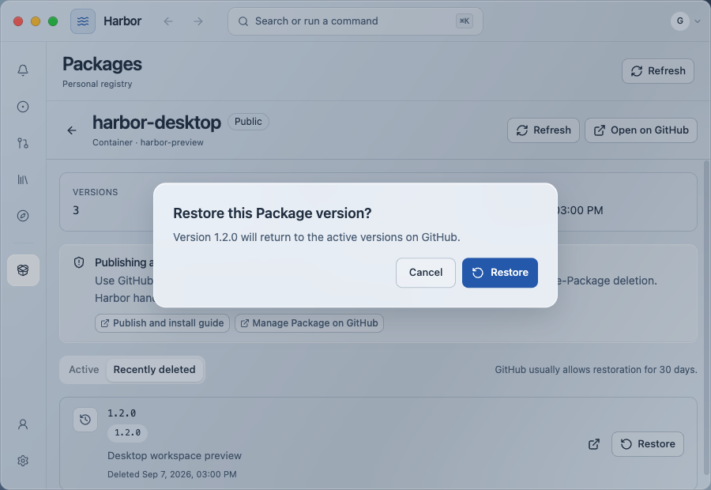
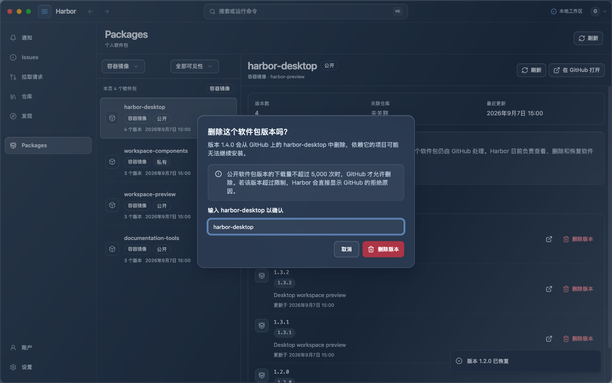
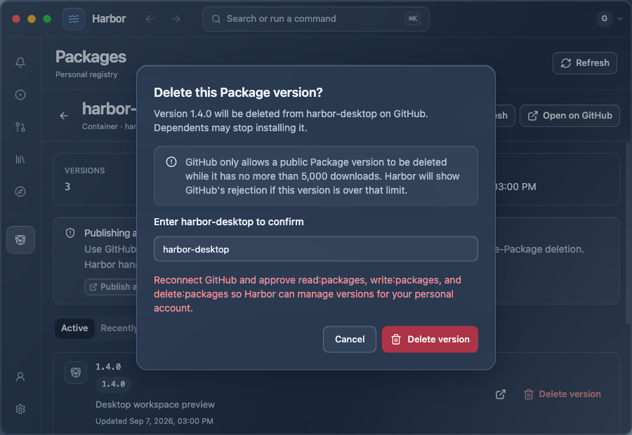
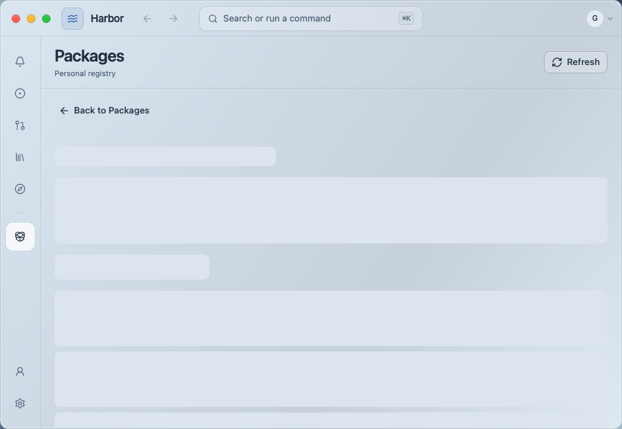

# Packages action acceptance

Selected production UI screenshots from the controlled browser preview on 2026-09-07. These are synthetic package records, with no live GitHub writes. Full scope and local matrix/log paths are in [UI_VERIFICATION.md](../../UI_VERIFICATION.md#package-version-actions-and-read-recovery--2026-09-07).

| Scenario | Capture |
| --- | --- |
| English, light, 900 px, restore |  |
| Chinese, dark, 1440 px, delete |  |
| English, dark, 900 px, permission error |  |
| English, light, 900 px, loading and Back |  |
