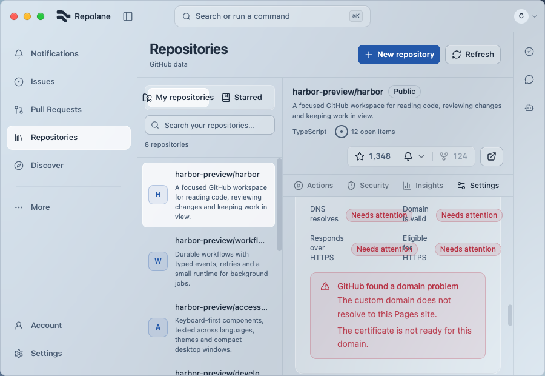
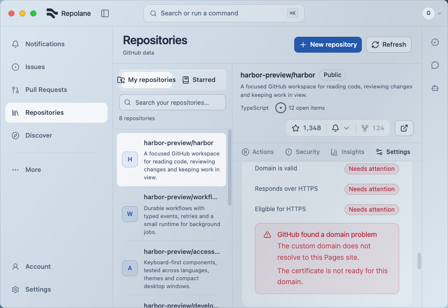
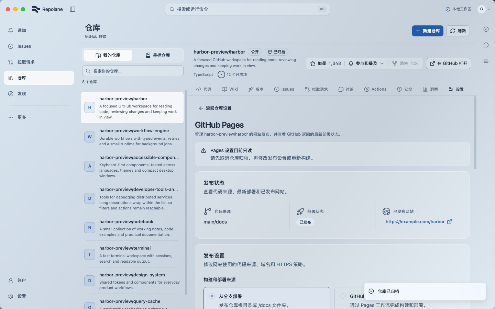
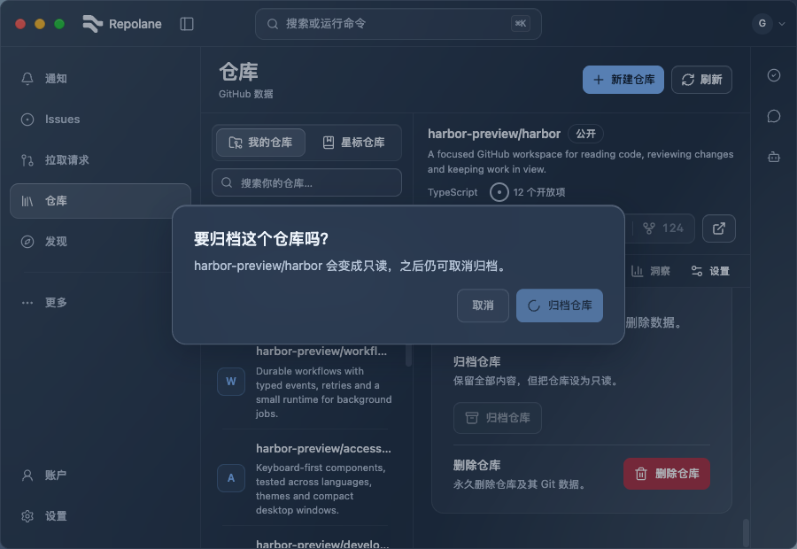
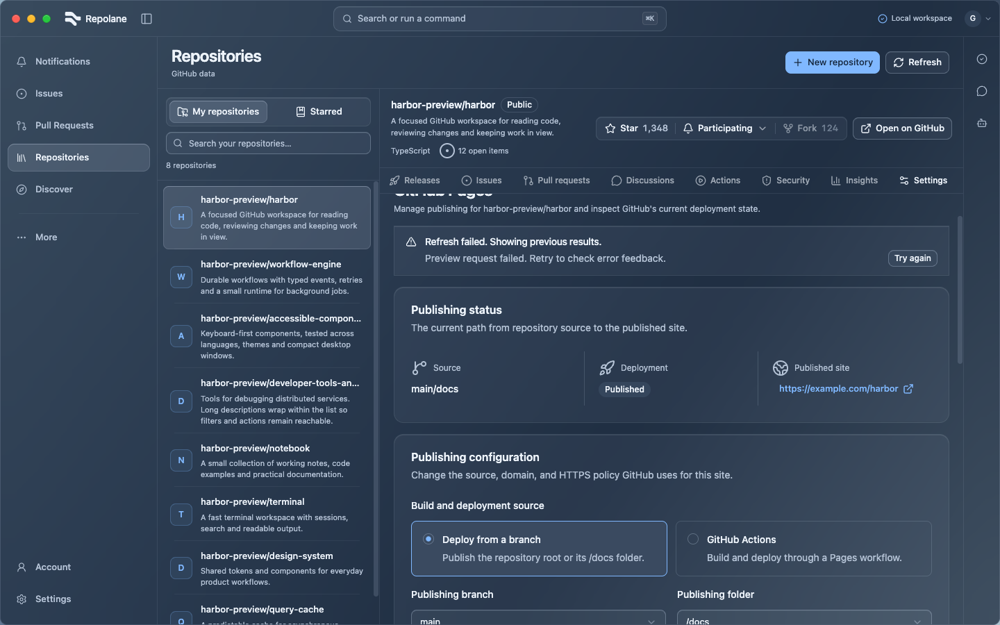

# Repository archive and Pages acceptance — 2026-09-09

Controlled production UI; no real GitHub business writes. The before/after pair uses the same health-error content. Full evidence and limits are in [UI verification](../../UI_VERIFICATION.md).

