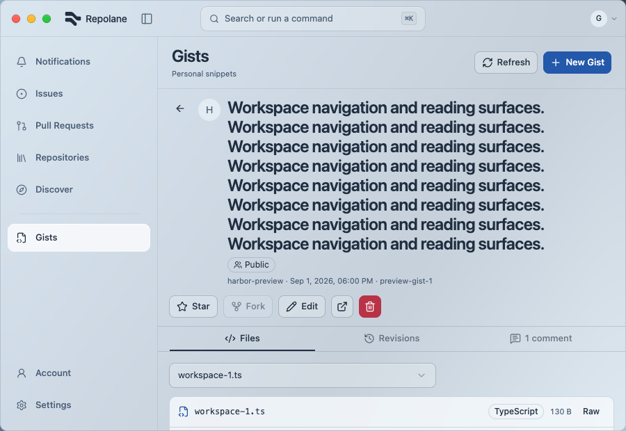
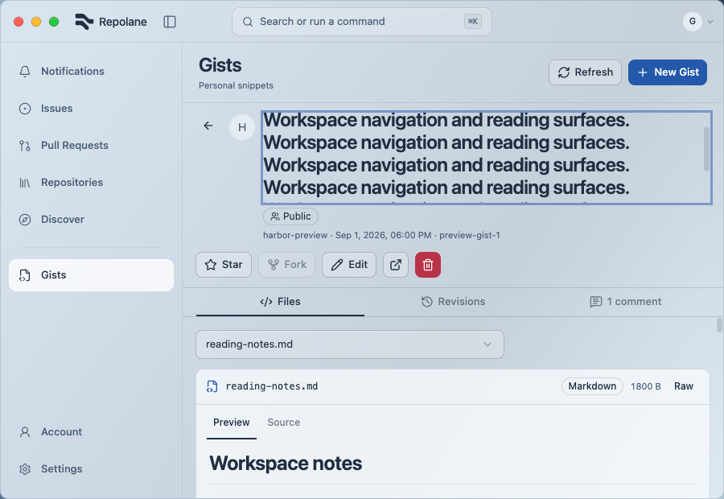
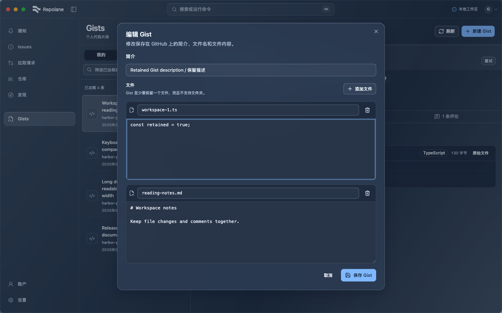
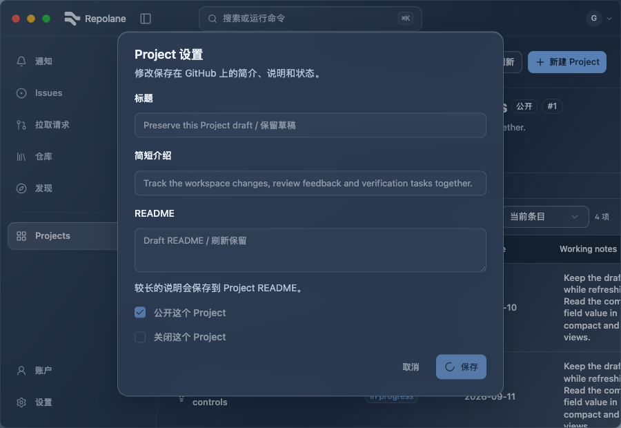
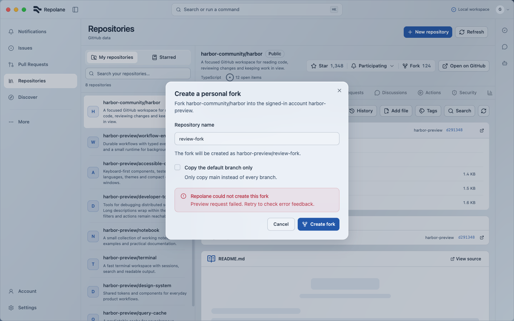
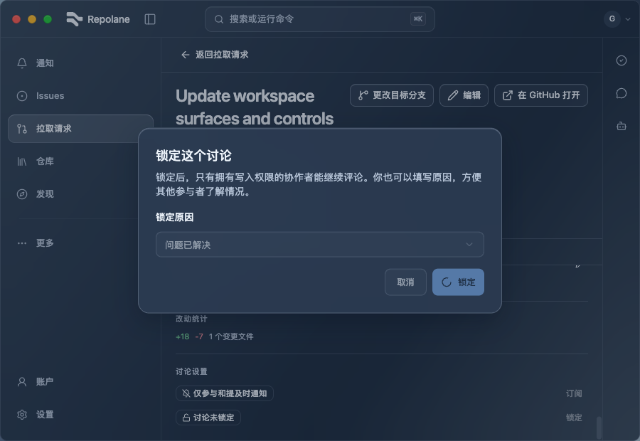

# Recent action acceptance — 2026-09-09

Controlled browser fixtures only. These selected captures accompany the completed repository, Project, Gist and conversation-write matrices. Conversation read/reaction and final shared/native acceptance remain open. See [UI verification](../../UI_VERIFICATION.md) for the precise scope.

