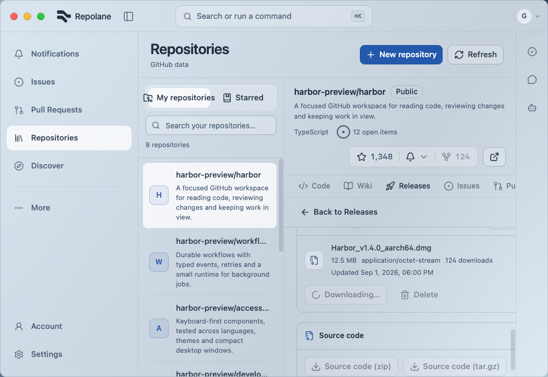
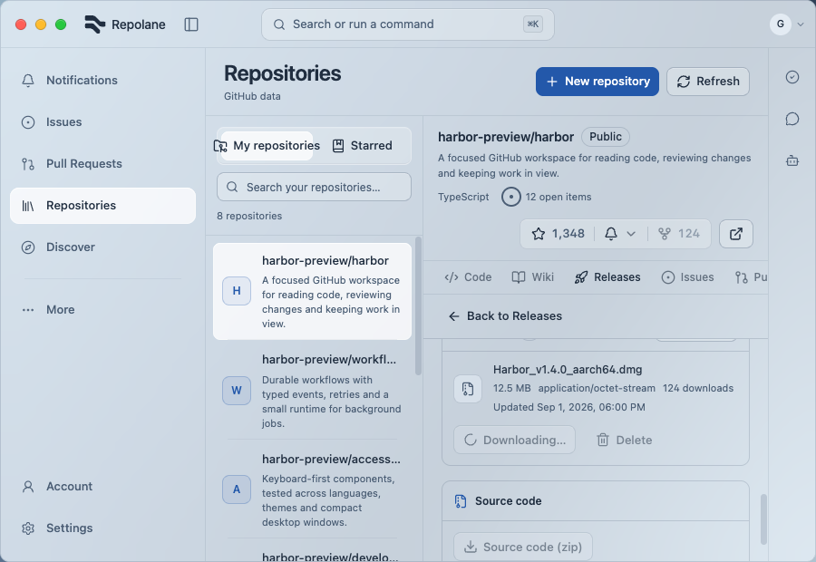
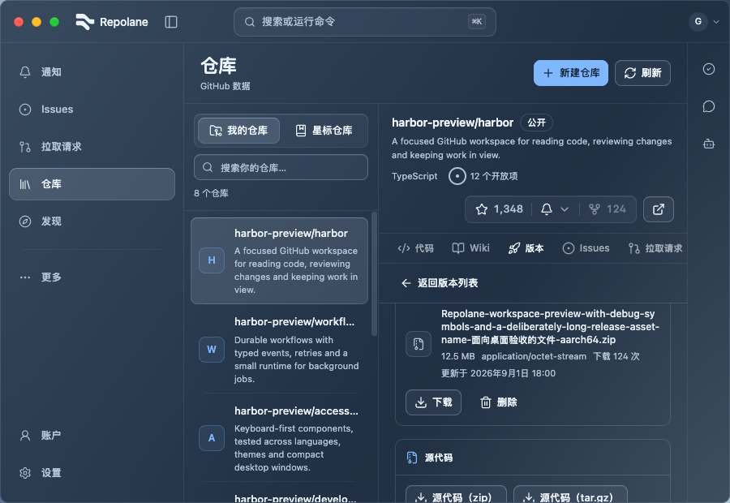
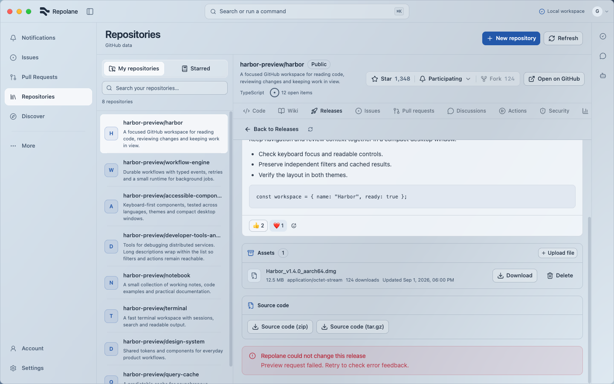
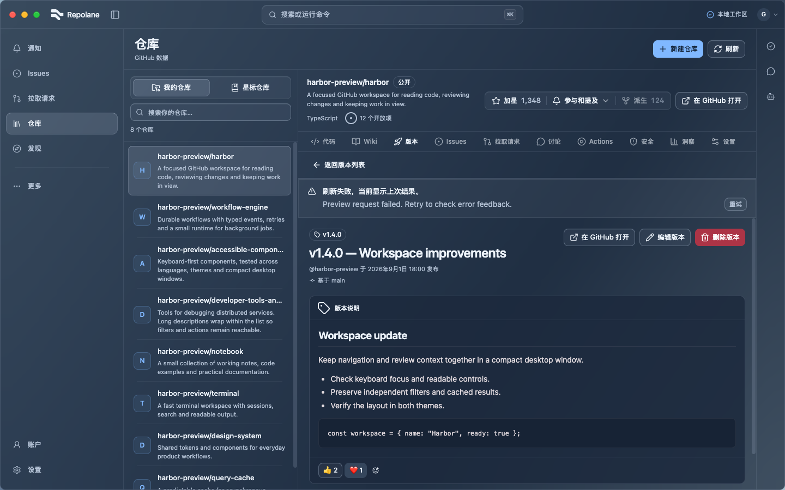
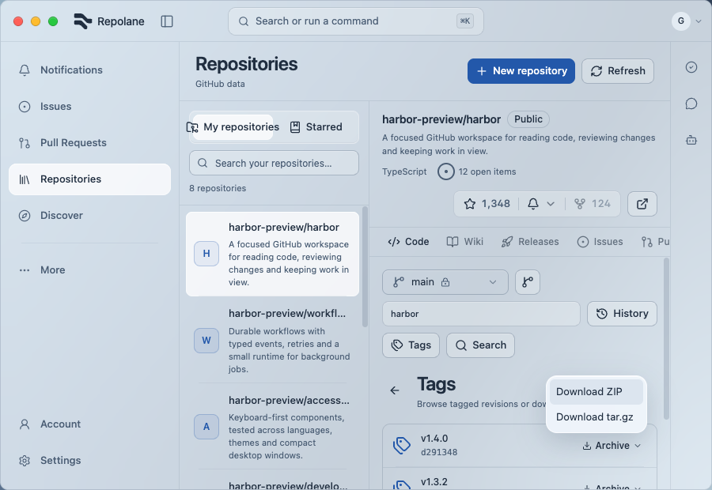

# Release and code transfer acceptance — 2026-09-09

Production browser UI with controlled fixtures. Synthetic saved paths do not establish native file picker or actual filesystem transfer behavior. See [UI verification](../../UI_VERIFICATION.md) for the full 264-scenario scope.

