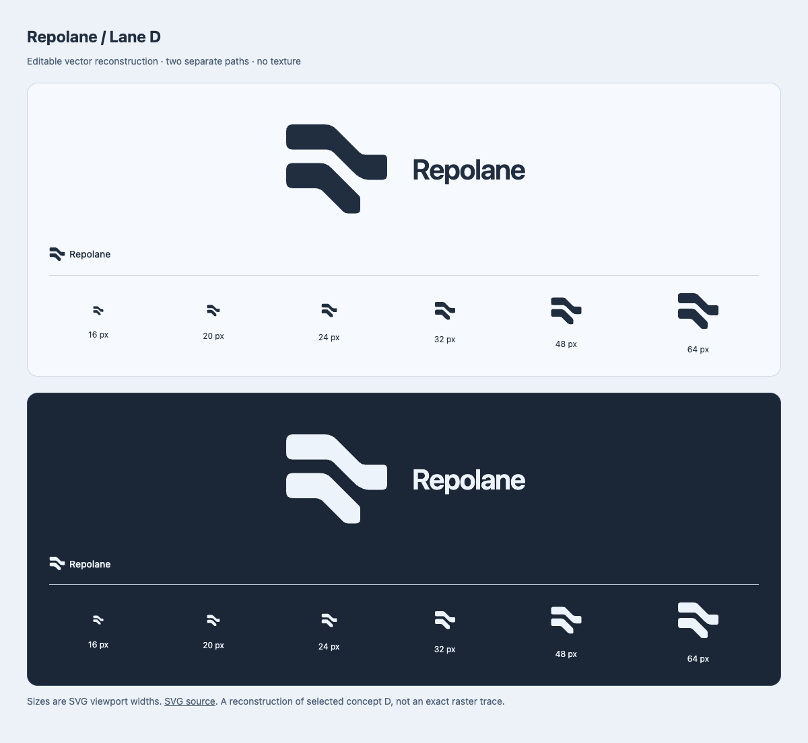
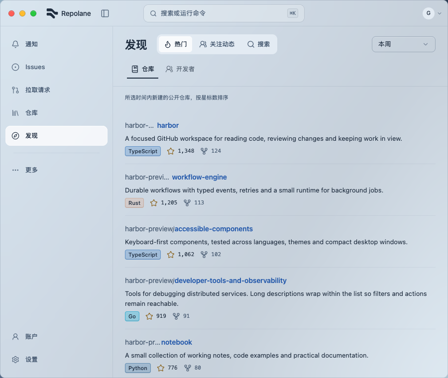
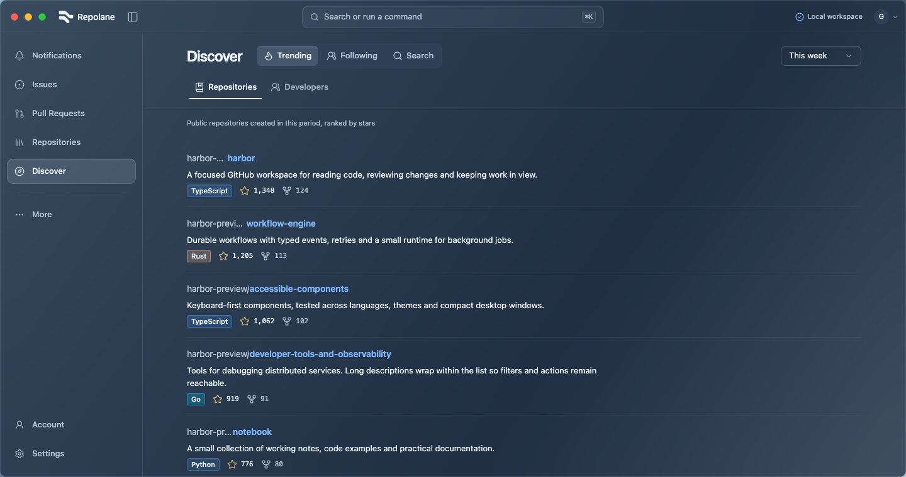
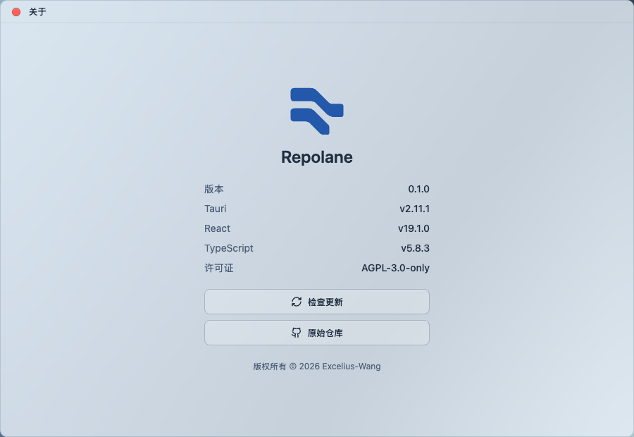
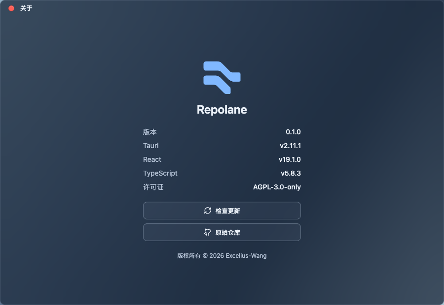

# Repolane Lane identity

The user accepted Lane D and the current in-app integration on 2026-09-08. These captures show the production components with controlled, local-only preview data. They are browser captures, not native-window evidence.

| Scenario | Capture |
| --- | --- |
| Reconstructed contour in both themes, 16–64 px widths |  |
| Chinese workspace at 900 px |  |
| English workspace at 1440 px |  |
| About, light |  |
| About, dark |  |

Eight browser scenarios cover en/zh × light/dark × 900/1440 px, including Enter/Space navigation toggling and horizontal containment. Both About themes and the standalone favicon's light/dark foreground were checked. The editable SVG, inline component and preview share identical path data. The two paths remain separated at 16 px; the titlebar uses a 24 × 22 px viewport.

Lane-specific native-window inspection and Dock/release-icon migration remain outside this acceptance. The titlebar retains inline SVG because the prior CSS mask implementation failed in native WebView.

Local delivery gate: `pnpm check` passed all 611 tests in 127 files, formatting, lint, TypeScript and production build; `cargo check --manifest-path src-tauri/Cargo.toml` passed. The first full test run timed out once in the unrelated code-navigation suite; its isolated rerun and the complete rerun passed without code changes. Existing rail-hook and bundle-size warnings remain.
