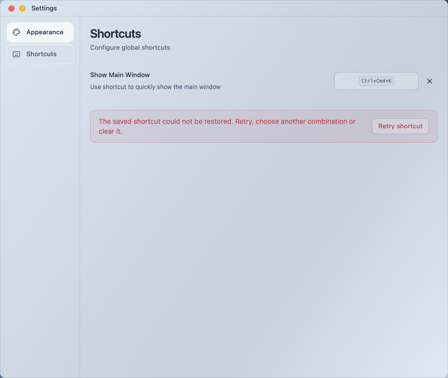
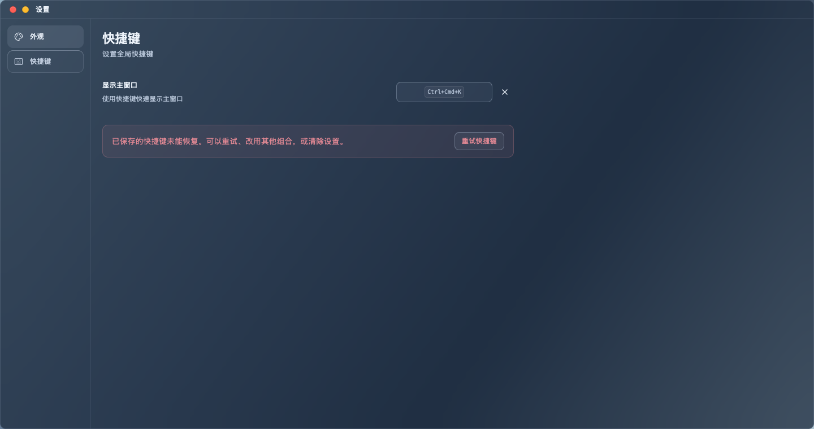
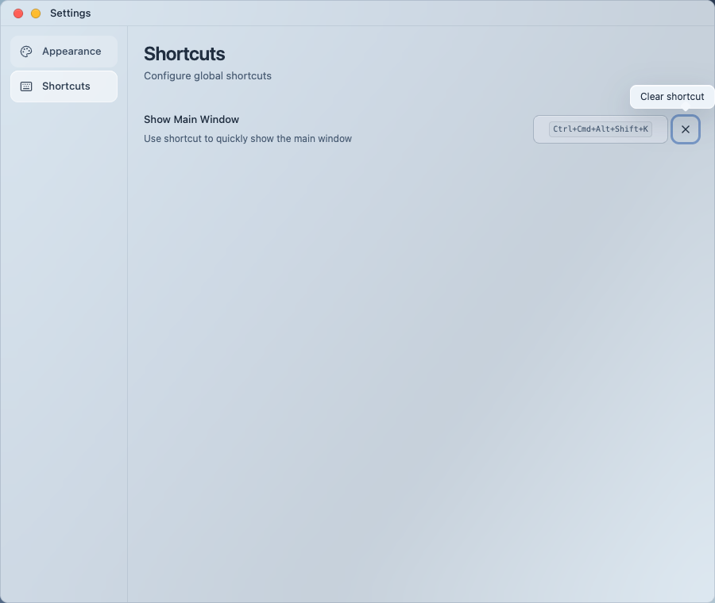

# Shortcut capture and restoration (#105, #106)

Capture preserves Ctrl and Command together, with stable Alt/Shift ordering. Explicit click focus also supports native WebKit, where clicking the capture button did not focus it during this QA. The saved shortcut stays visible on restoration failure, with bilingual feedback, same-combination retry and clearing. A failed replacement does not erase the restoration failure or block retry of the saved combination.

Registration reuses the existing native plugin and keeps an already registered combination. It removes the previous combination only after its replacement succeeds. Concurrent restoration is accepted only when the plugin confirms the application owns the desired shortcut. The plugin's app-level handler sends Pressed events to main, which uses the existing toggleWindow helper; callbacks no longer depend on Settings remaining open. Settings broadcasts actual restoration results and Home consumes them without registering again.

Verification on 2026-09-14:

- Initial focused regressions reproduced modifier loss and missing restoration feedback. Final focused coverage includes failure/retry/clear, failed replacement followed by same-value retry, preserved old configuration, simultaneous restoration, native-event dispatch/error handling, and click focus. Existing Tab and pure-modifier tests remain applicable.
- `VITEST_MAX_WORKERS=2 pnpm check`: 740 tests / 144 files plus formatting, lint, TypeScript and build pass. An earlier concurrent run timed out in an unchanged README test; bounded-worker rerun passed. Existing hook/SQLite/chunk-size warnings remain unrelated.
- `cargo check` and an isolated Tauri debug build pass. No new persistence format, native command or runtime dependency was introduced.
- [Eight controlled browser cases](results.json): EN/ZH, light/dark, 900/1440 px at 760 px height; retained saved value on restore/retry failure, clear, successful all-modifier capture and Tab navigation. No horizontal overflow. All business calls remain intercepted.
- Native macOS QA uses temporary bundle `com.harbor.shortcutqa` and the controlled preview at port 1438. Initially clicking capture did not focus it; after the local focus fix, Ctrl+Cmd+K and Ctrl+Cmd+Shift+H displayed and registration returned success, including reopening Settings without error. Synthetic tool key events did not establish system-level activation; physical-key verification of hide/show and behavior after closing Settings remains **pending**. Do not treat the browser or event mock as physical-key evidence.

Reproduce from this worktree:

```bash
pnpm dev:ui --port 1438
mkdir -p output/playwright/shortcut-registration
# Start a Playwright CLI session rooted in this worktree at:
# http://localhost:1438/ui-components?view=settings
# Run qa.js with run-code --filename, then inspect the captures.
cp output/playwright/shortcut-registration/en-light-900-error.png docs/verification/shortcut-registration/en-light-900-error.png
cp output/playwright/shortcut-registration/zh-dark-1440-error.png docs/verification/shortcut-registration/zh-dark-1440-error.png
cp output/playwright/shortcut-registration/en-light-900-success.png docs/verification/shortcut-registration/en-light-900-success.png
```

[QA script](qa.js). The CLI expects a function expression without a trailing semicolon. `shortcut=restore-error` fails registration while allowing clear; ordinary preview registration succeeds. Native plugin calls remain real in the isolated desktop preview. Reusing a previously created CLI session writes captures relative to that session's starting directory.





Independent Standards review found no hard violations; its stale-clear feedback and native-event test recommendations were addressed. Spec review found two implementation gaps (duplicate cross-window registration and failed-replacement retry); both were fixed and the delta review cleared them. Physical-key verification remains the delivery gate above. Shared materials/layout and unaffected appearance settings are unchanged; no full-site acceptance claim.
