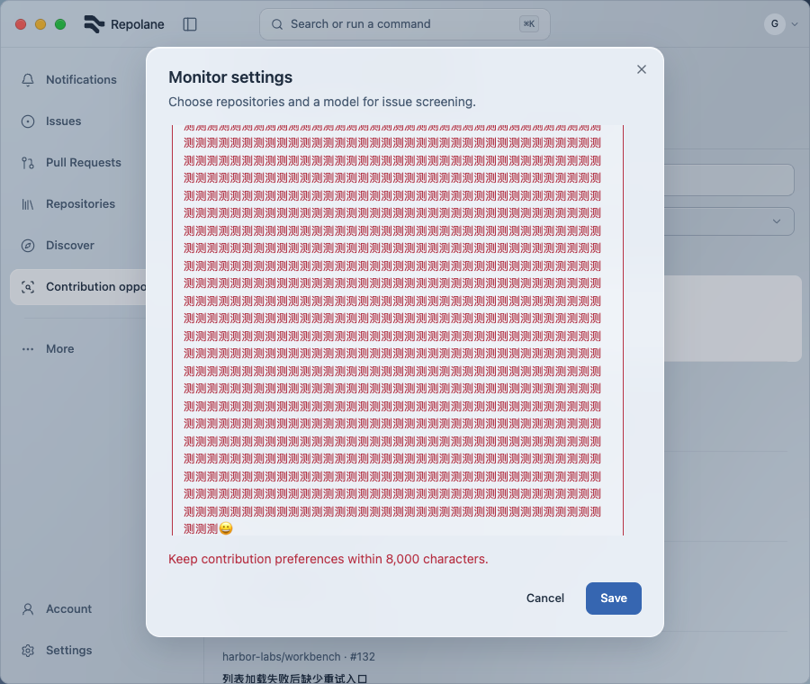
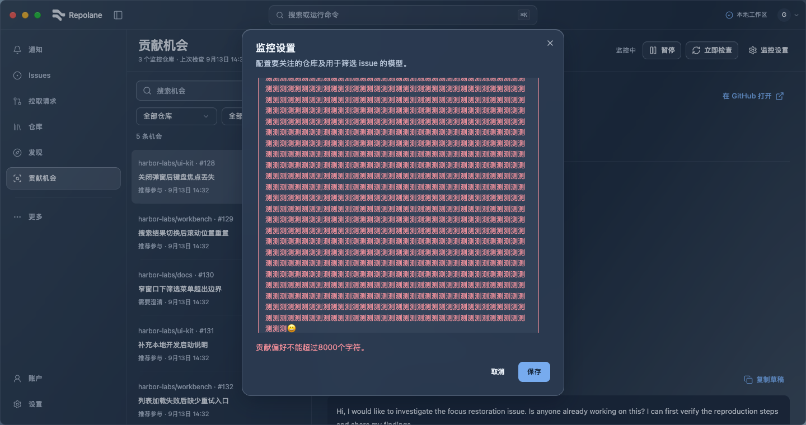

# Unicode preference validation (#100)

Rust now counts UTF-16 units, matching the existing HTML maxLength of 8,000. Chinese input no longer reaches the limit at 2,667 characters; supplementary symbols count as two units. Overlong preferences return their own error, with field highlighting and matching English/Chinese guidance. The model-name validation is unchanged.

Verification on 2026-09-14:

- Native regression failed before the fix and passes afterward: ASCII and Chinese 8,000/8,001; emoji 4,000/4,001; original 2,667-Chinese reproduction; separate model error. All 28 opportunity tests and cargo check pass.
- Component regression covers field-specific feedback, retained Unicode draft and successful retry.
- `VITEST_MAX_WORKERS=2 pnpm check`: 725 tests / 143 files, formatting, lint, TypeScript and build pass. An earlier simultaneous full-suite run timed out in the unchanged profile README test; bounded-worker rerun passes without modifying that test. Existing hook/SQLite/chunk-size warnings remain.
- [Eight controlled browser cases](results.json) cover EN/ZH, light/dark, 900/1440 px at 760 px height, long Unicode draft retention, field error and keyboard retry. The synthetic preferences-error fixture rejects once independently of input length, then accepts; it tests UI recovery, not native validation. Business calls remain intercepted.

Reproduce from the repository root:

```bash
pnpm dev:ui --port 1437
mkdir -p output/playwright/unicode-validation
# Open http://localhost:1437/ui-components?view=opportunities in Playwright CLI.
# Run qa.js with the CLI run-code --filename option, then inspect captures.
cp output/playwright/unicode-validation/en-light-900.png docs/verification/unicode-validation/en-light-900.png
cp output/playwright/unicode-validation/zh-dark-1440.png docs/verification/unicode-validation/zh-dark-1440.png
```

[QA script](qa.js)




The existing content-sized textarea scrolls within the dialog for long input; footer error and retry remain reachable. Unchanged loading/list/layout/material paths retain prior evidence only for that unchanged scope. No full-site or native visual acceptance claim.
