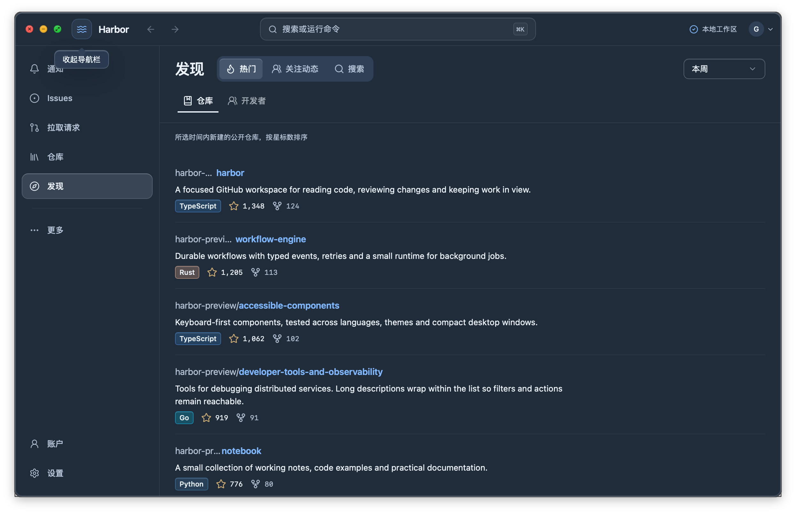
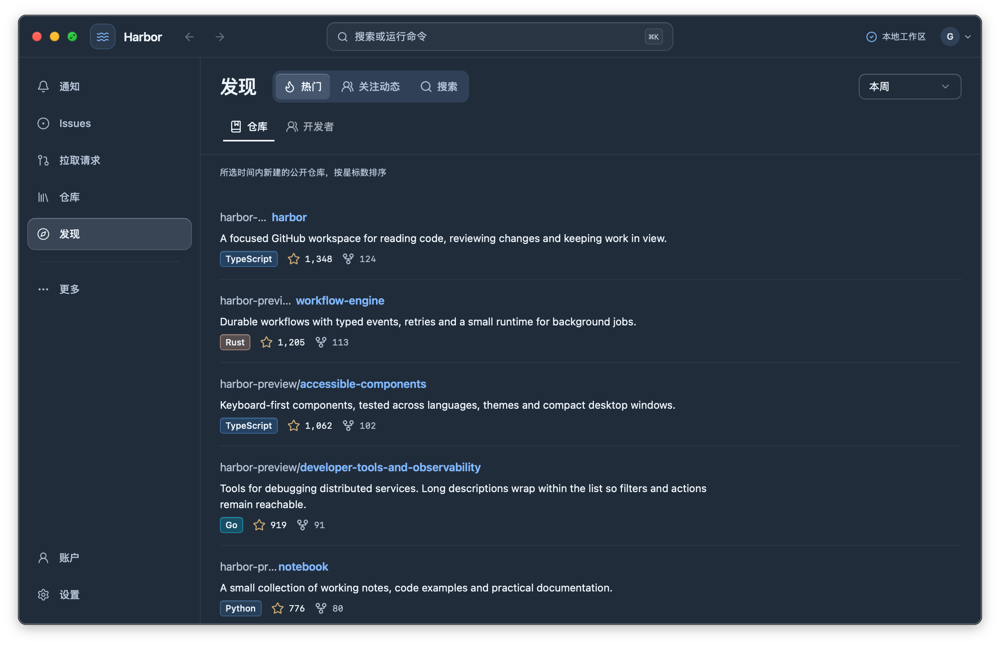
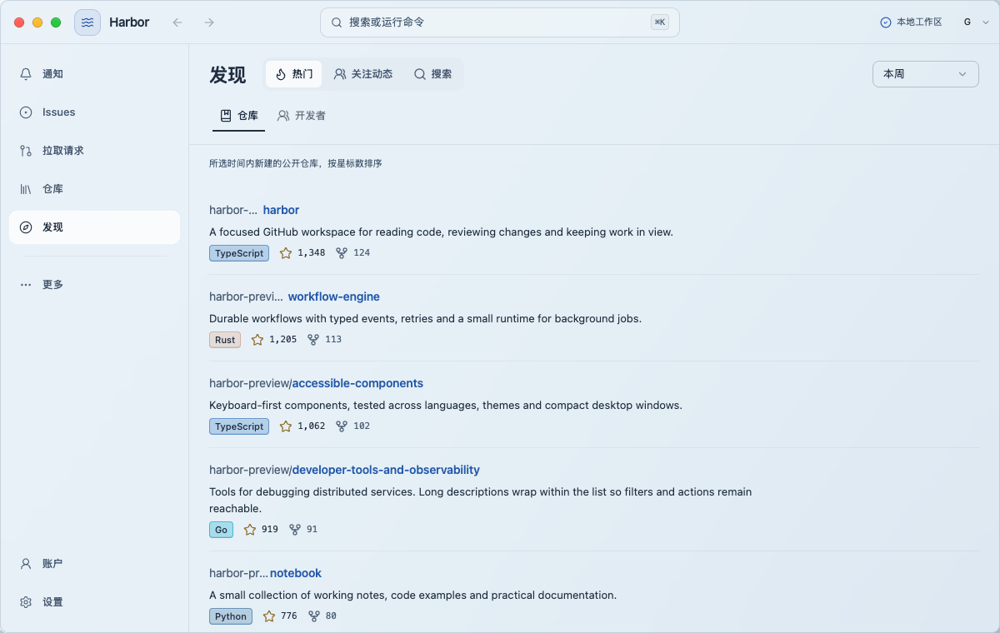
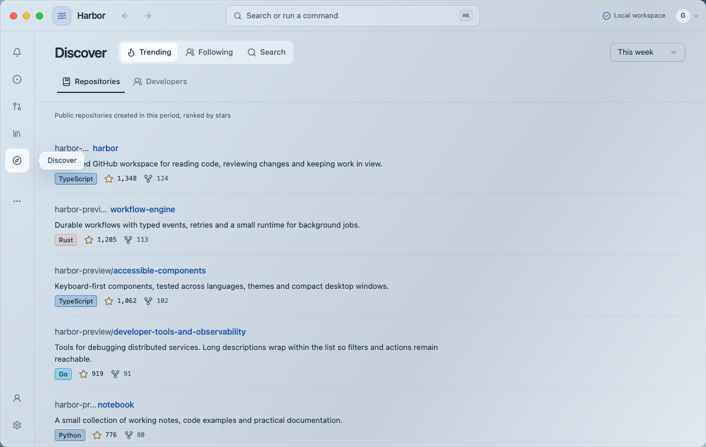

# Window shell acceptance

Selected captures from the production UI with controlled, local-only GitHub fixtures. Full checks and limitations are recorded in [UI_VERIFICATION.md](../../UI_VERIFICATION.md#outer-edge-refinement-and-self-review--2026-09-07).

| Scenario | Capture |
| --- | --- |
| Native dark window before edge cleanup |  |
| Native dark window after edge cleanup |  |
| Light theme at the 1200 px startup width over a bright browser background |  |
| Collapsed navigation with the Logo toggle (captured before the final edge refinement) |  |

The window opens at 1200 × 760 logical units when its work area allows. The Logo toggles between 226 px navigation with labels and the 58 px icon rail. Browser tests cover preference persistence, keyboard interaction, reduced transparency and three controlled backgrounds. Native evidence covers sizing and dark window edges; the broader native material matrix remains open.
